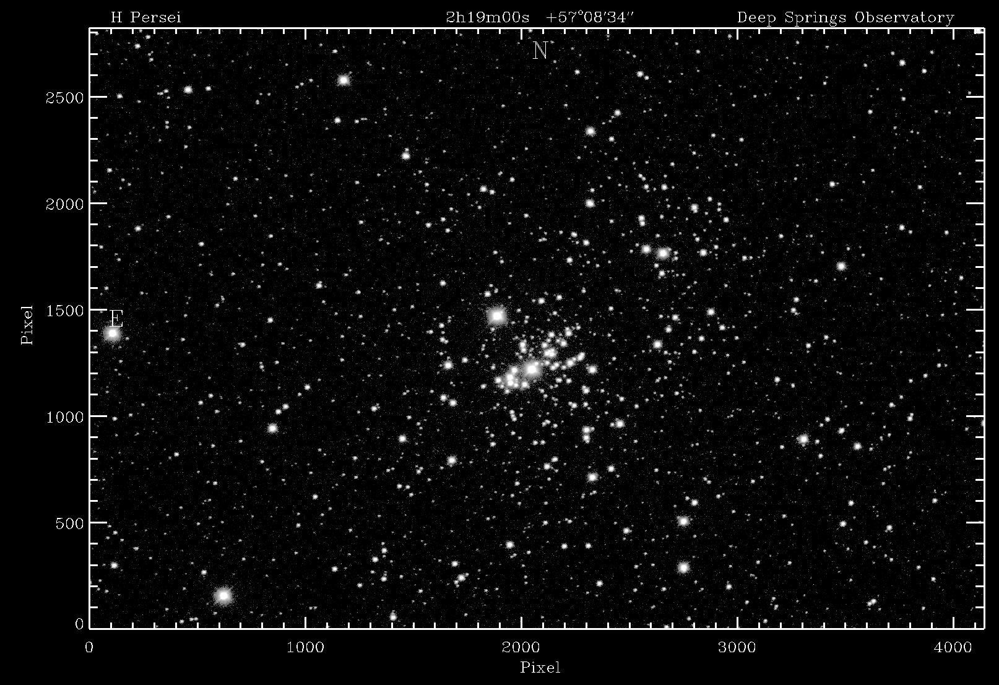
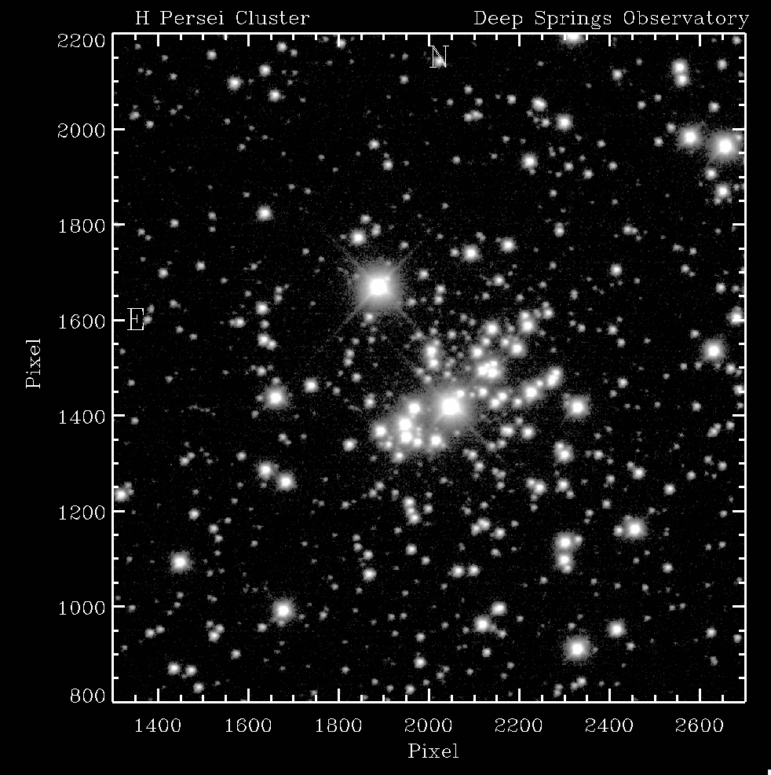
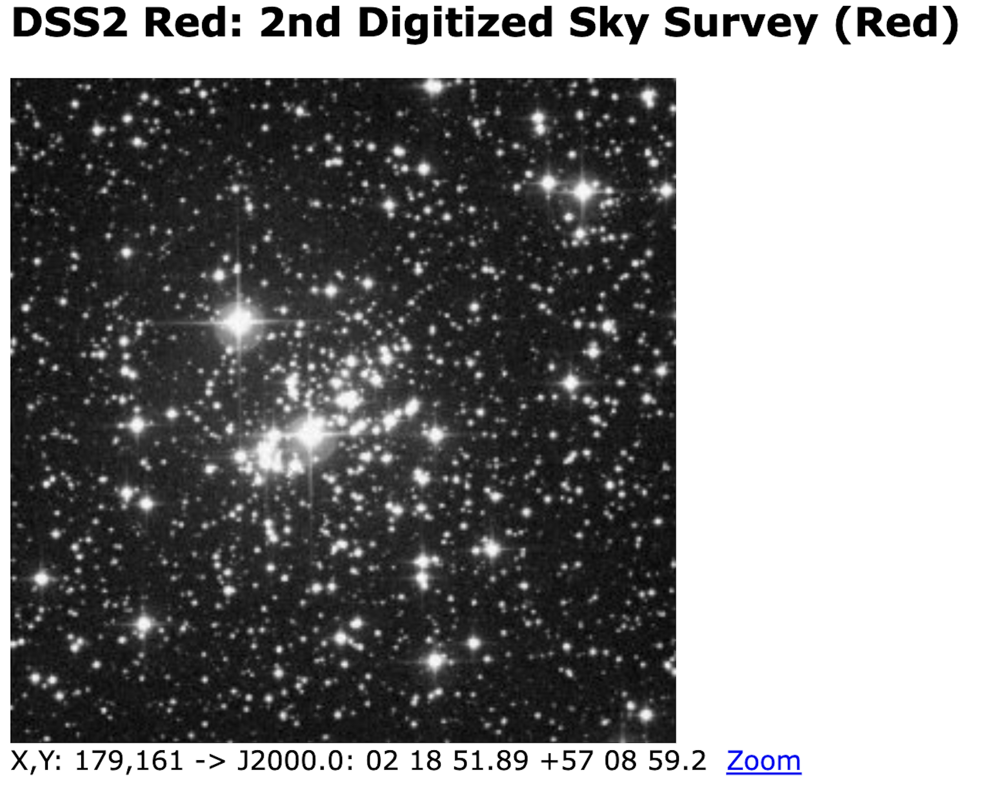
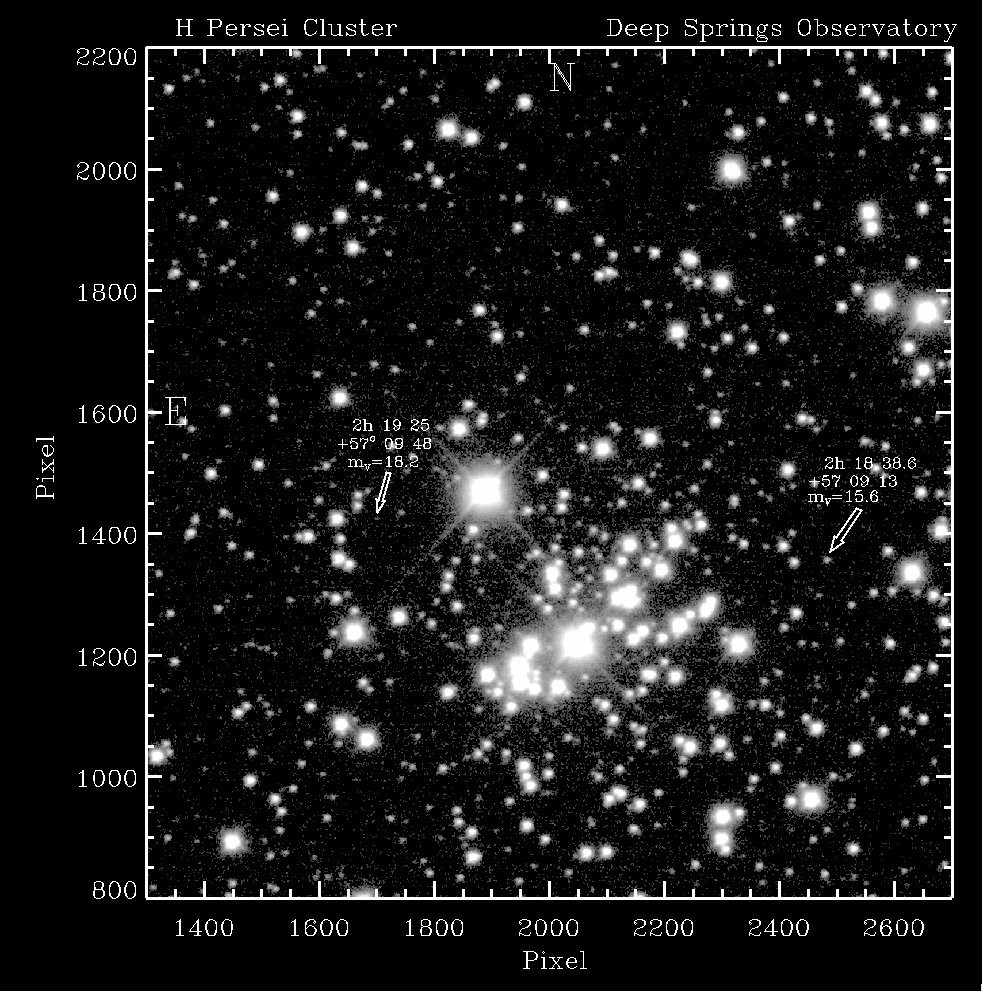

## Geoff's Analysis of the 2022-10-1819 Data

### Deep Springs vs. Palomar Sky Survey DSS2 Red

Deep Springs CBB:



Deep Springs CBB-Zoomed:



DSS2 Red:



### Identification of Mag 18 Target

[Identified 2MASS J02192514+5709480](http://simbad.cds.unistra.fr/simbad/sim-id?Ident=%406340548&Name=2MASS%20J02192514%2b5709480&submit=submit)



### How this is done in IDL

```
pro display_h_and_chi
;Display the inaugural image of the completed Deep Springs Observatory
;H and Chi Persei
;
im = mrdfits('_CBB_2x2_30.000secs_0.00C_00006826.fit',0,h)

mim = im - median(im)
sc=0.4
!p.charsize=2.5

window,0,xs=4100*sc,ys=2800*sc
;rmim = rotate(mim,2)

;trmim = transpose(rmim)
revrmim = reverse(mim,2)
display,revrmim,min=15,max=1000,/log,xt='!6 Pixel',yt='!6 Pixel'
xyouts,3000,2850,'Deep Springs Observatory'
;xyouts,100,2850,'!6H & !7V!6 Persei'
xyouts,100,2850,'!6H Persei Cluster'
xyouts,2050,2680,'N',size=4
xyouts,90,1420,'E',size=4
xyouts,1650,2850,'2h19m00s  +57!uo!n08''34'''''

;Now Zoom
zim = revrmim(1300:2700,600:2000)
zim = median(zim,3)
xind = 1300 + indgen(1401)
yind=800+indgen(1401)
window,1,xs=1000,ys=1000
display,zim,xind,yind,min=5,max=1000,/log,xt='!6 Pixel',yt='!6 Pixel'
;xyouts,1700,2220,'2h22m27s , +57!uo!n06''34'''',size=0.3

xyouts,2100,2220,'Deep Springs Observatory'
xyouts,1350,2220,'!6H Persei Cluster'
xyouts,2000,2130,'N',size=4
xyouts,1330,1580,'E',size=4

;Now Zoom
zim = revrmim(1300:2700,800:2200)
zim = median(zim,3)
xind = 1300 + indgen(1401)
yind=800+indgen(1401)
window,2,xs=1000,ys=1000
display,zim,xind,yind,min=5,max=300,/log,xt='!6 Pixel',yt='!6 Pixel'
xyouts,2100,2220,'Deep Springs Observatory'
xyouts,1350,2220,'!6H Persei Cluster'
xyouts,2000,2130,'N',size=4
xyouts,1330,1580,'E',size=4
arrow,1720,1500,1701,1435
xyouts,1650,1510,'m!dV!n=18.2',size=1.6
xyouts,1630,1570,'  2h 19 25',size=1.6
xyouts,1630,1540,'+57!uo!n 09 48',size=1.6

end
```