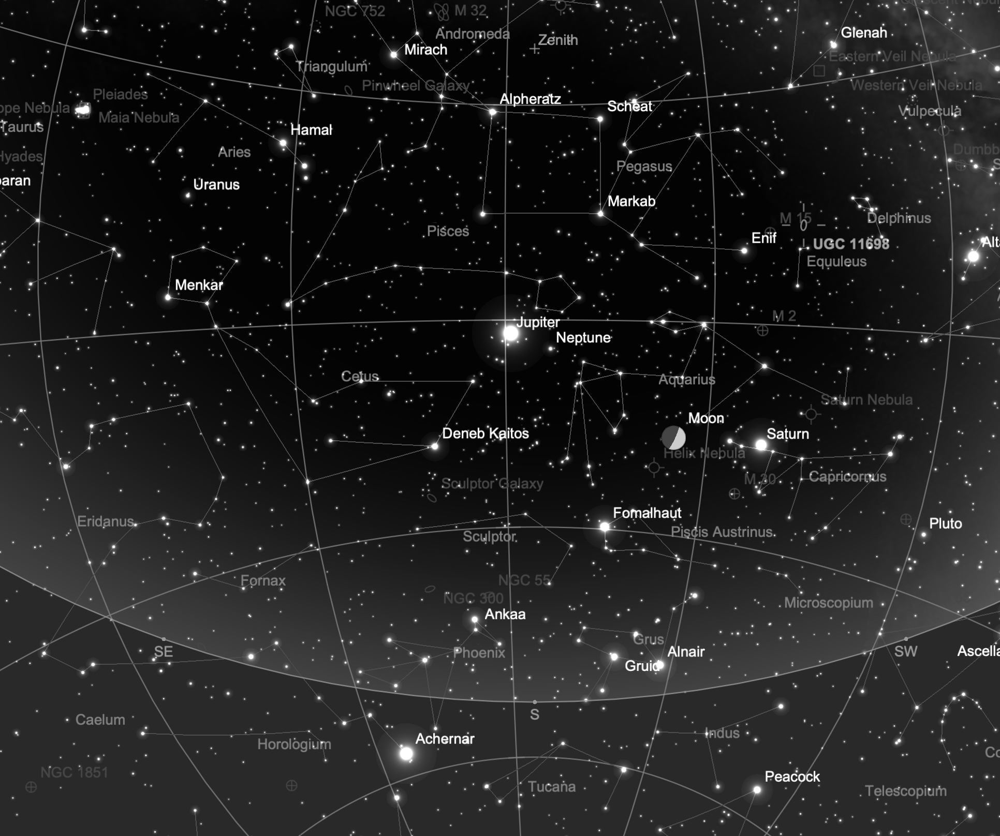
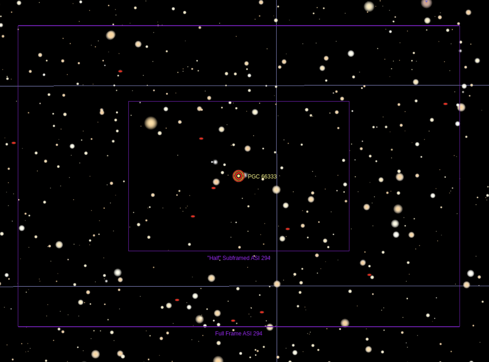
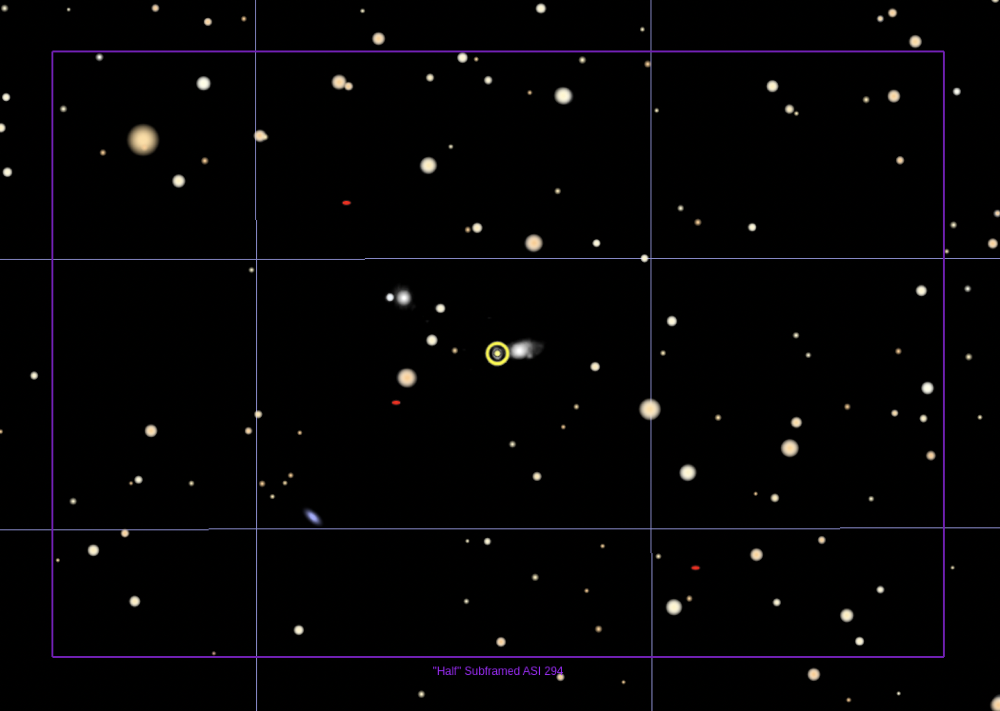

## SN 2022abik

### Discovery and Finder Charts

* Purdue Physics Latest Supernovae parameters: discovered 2022/11/23.201, host UGC 11698 (= PGC 66333), zhost=0.027639
* [TNS Page for SN 2022abik](https://www.wis-tns.org/object/2022abik)

#### TheSkyX Screenshots

*Full-frame, north down*

*Half-frame, north down*

### Observations and Analyses

* [2022-11-2930](./2022-11-2930/index.md)
* [2022-12-1415](./2022-12-1415/index.md)
