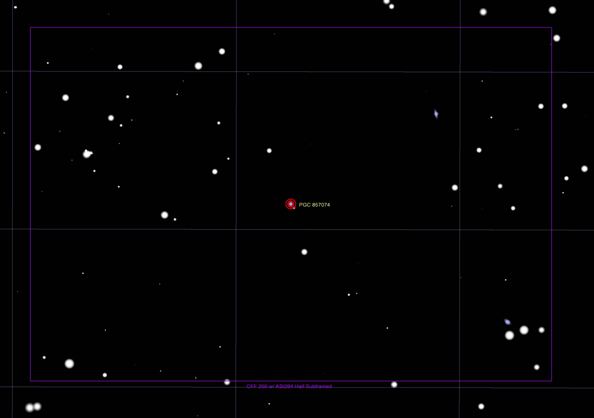

## SN 2022adqz Target Information

Back to [Index](../index.html)

### Discovery and Finder Charts

* [TNS Page for SN 2022adqz](https://www.wis-tns.org/object/2022adqz)
* [ALeRCE ZTF Explorer](https://alerce.online/object/ZTF22acablwr)
* PGC 857074 (aka LEDA 857074)
* SN RA/DEC: 03:45:50.449 -19:18:21.30

