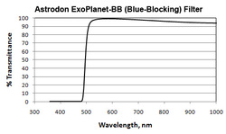
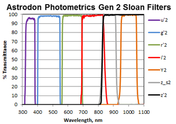
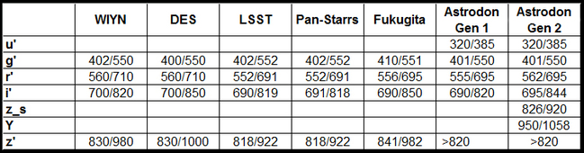

## Index to Equipment

*Features of our equipment that are often referred to during observing*

### Setup and Teardown Procedure

To minimize the chance of harm to the facility and the instruments, we have documented and we consistently follow our [Setup and Teardown Procedure](./SetupAndTeardownProcedure.pdf).

### Camera

Consult the [Plate Scale Calculator](./PlateScaleCalculator.pdf).

### Filters

Our filter wheel contains Astrodon CBB, g', r', i', and z' filters.

#### CBB

The CBB blocks light short of 500nm. It is particularly useful when there is a lot of light pollution (including when the Moon is prominent):

#### Sloan g', r', i', and z'

Together the g' and r' filters cover most of the visible spectrum (380nm to 700nm):

* g' is a bandpass from 401 to 550nm.
* r' is a bandpass from 562 to 695nm.
* i' is a bandpass from 695 to 844nm.
* z' blocks light short of 820nm.

