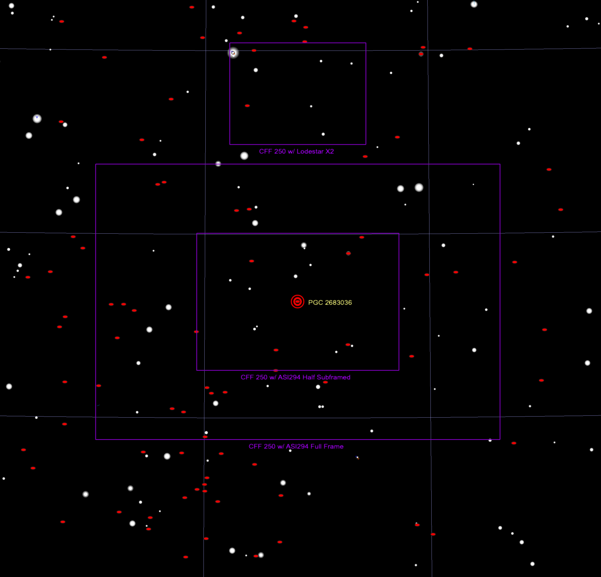
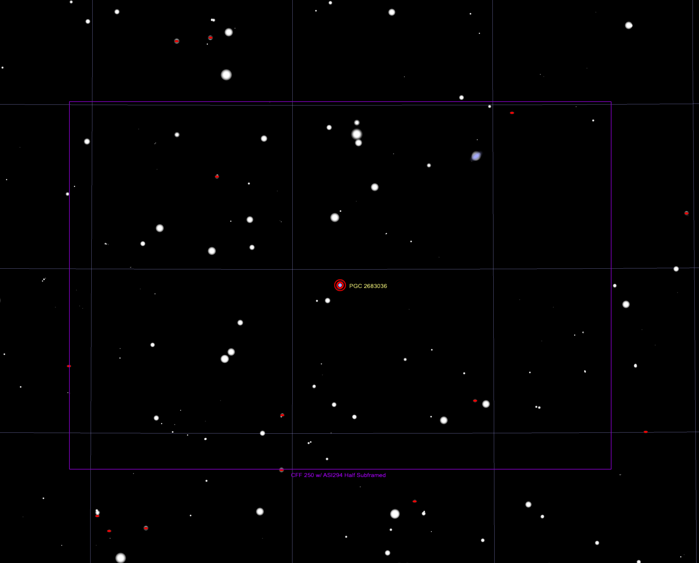

## AT 2023bhc Target Information

Back to [Index](../index.html)

### Discovery and Finder Charts

* [TNS Page](https://www.wis-tns.org/object/2023bhc)
* [ALeRCE ZTF Explorer](https://alerce.online/object/ZTF23aabtrno)
* Discovery Date: 2023-02-04T07:20:15Z
* Host Name (and Aliases): PGC 2683036
* Target Coordinates (J2000): RA 12h 36m 42.420s, DEC +66&deg; 02' 28.94"

