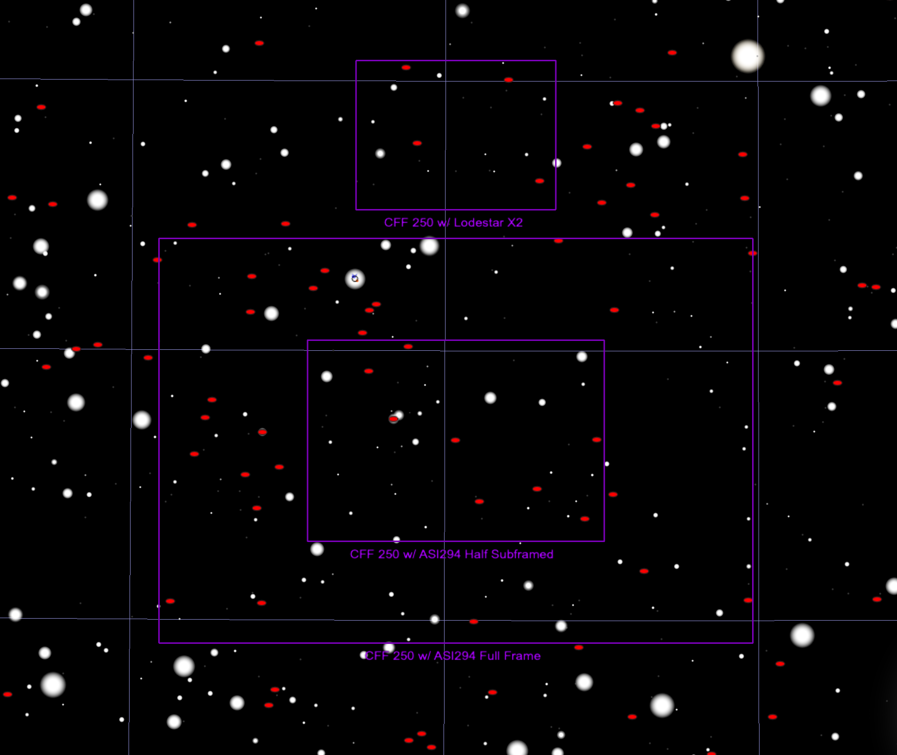
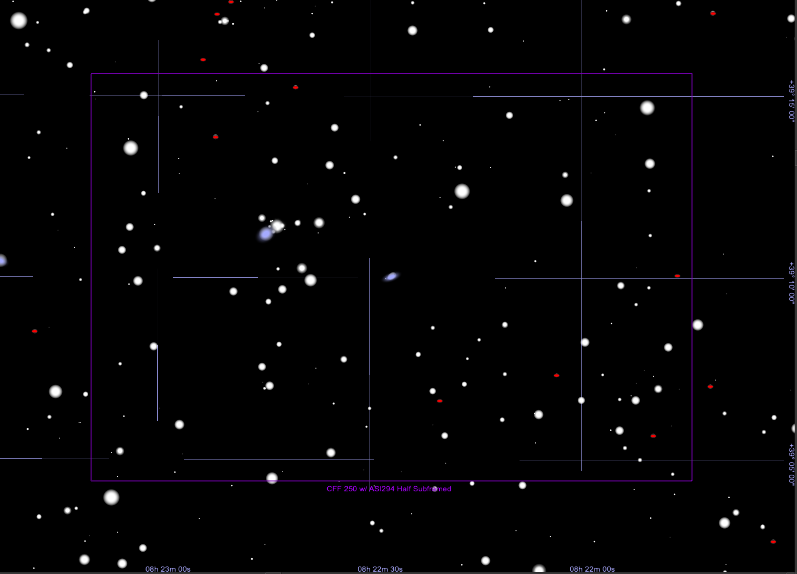

## AT 2023buy Target Information

Back to [Index](../index.html)

### Discovery and Finder Charts

* [TNS Page](https://www.wis-tns.org/object/2023buy)
* [ALeRCE ZTF Explorer](https://alerce.online/object/ZTF23aacjetk)
* Discovery Date: 2023-02-17 05:08:54.001
* Host Name (and Aliases): PGC 3996411 (SDSS J082054.22+391423.0)
* Target Coordinates (J2000): RA 08h 20m 53.696s, DEC +39&deg; 14' 29.67"

