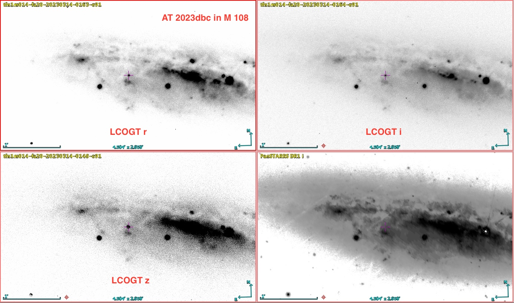
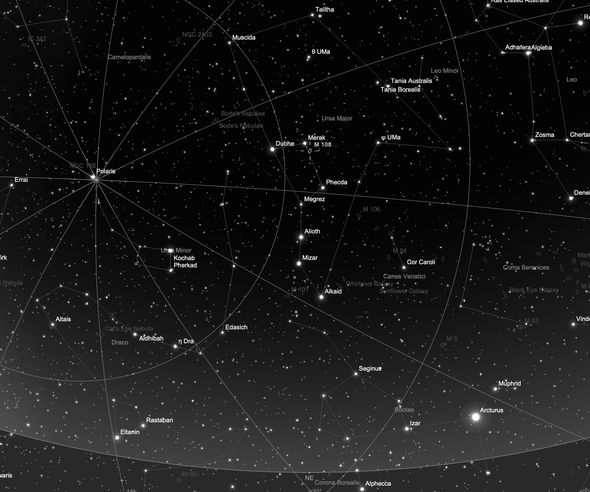
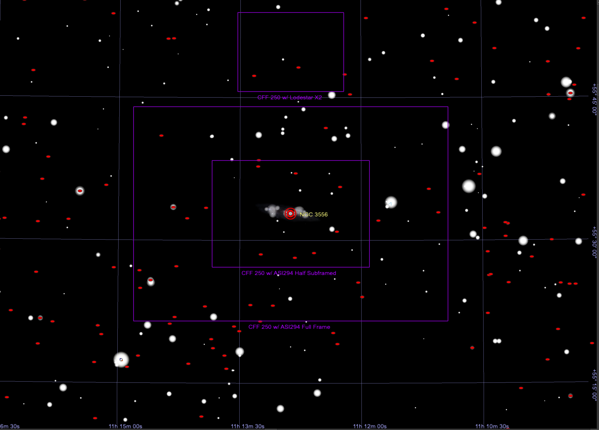
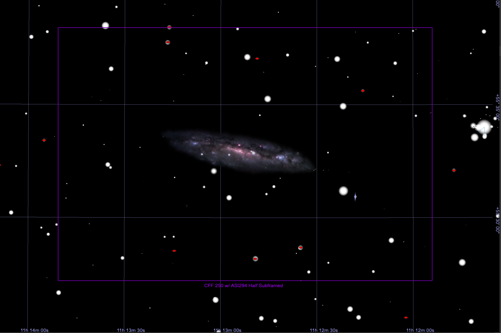

## AT 2023dbc Target Information

Back to [Index](../index.html)

### Discovery and Finder Charts

* [TNS Page](https://www.wis-tns.org/object/2023ZZZZ)
* [ALeRCE ZTF Explorer - NO LINK](https://alerce.online/object/ZTF23AAAAAA)
* Discovery Date: 
* Host Name (and Aliases): NGC 3556 (M108)
* Target Coordinates (J2000): RA XXh YYm ZZ.zzzs, DEC +UU&deg; VV' WW.ww"

