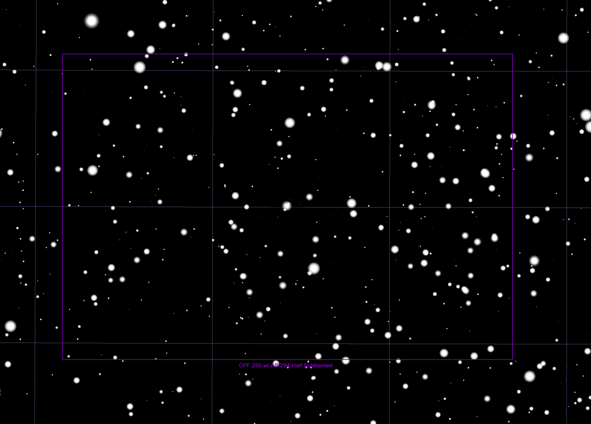

## SN 2023cf Target Information

Back to [Index](../index.html)

### Discovery and Finder Charts

* Discovered by Kishalay De, Caltech on behalf of ZTF report/s the discovery of a new astronomical transient.

* [TNS Page](https://www.wis-tns.org/object/2023cf)
* [ALeRCE ZTF Explorer](https://alerce.online/object/ZTF23aaaatjn)
* Discovery Date: 2023-01-07 05:24:06.912 (JD=2459951.72508)
* Host Name: UGC 3044 (known to TheSkyX as PGC 15112)
* Target Coordinates (J2000): RA = 04:26:49.491 (66.706213) DEC = +29:56:59.84 (29.9499567)

