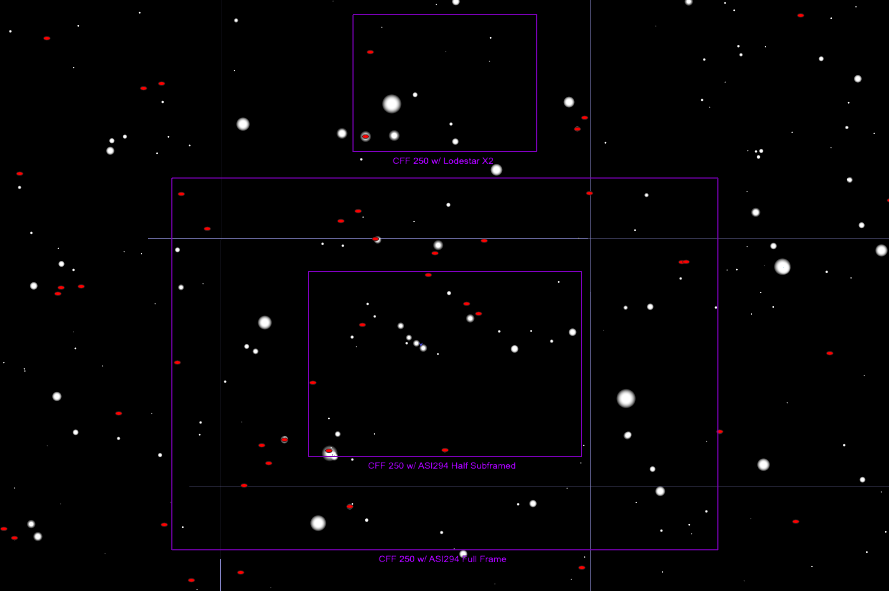

## Wolf 259 Target Information

Back to [Index](../index.html)

### Context

This is a red dwarf, quite nearby, that will be opposite the Sun in March, and therefore any laser light beamed from the star at our Sun will also pass us. (E.T. could be beaming laser light past our Sun to use our Sun as a gravitational focus.)

Geoff requests imagery in r-band.

### Coordinates and Finder Charts

The star has a proper motion of RA: –3,866 mas/yr, DEC: –2,699 mas/yr arcsec per year. During 2023, these J2000.0 coordinates should be used:

```
RA: 10 56 23.2
DEC: +06 59 51
```

The star comes is 30&deg; above the eastern horizon at 12am Deep Springs time.


