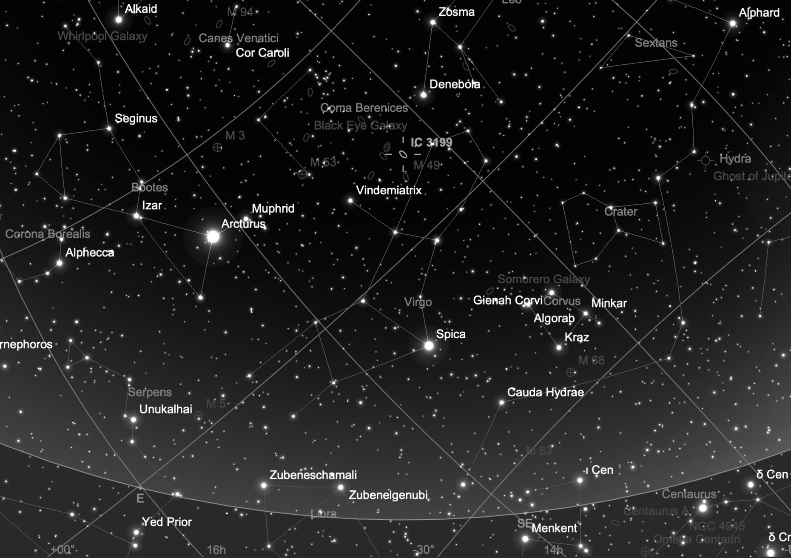
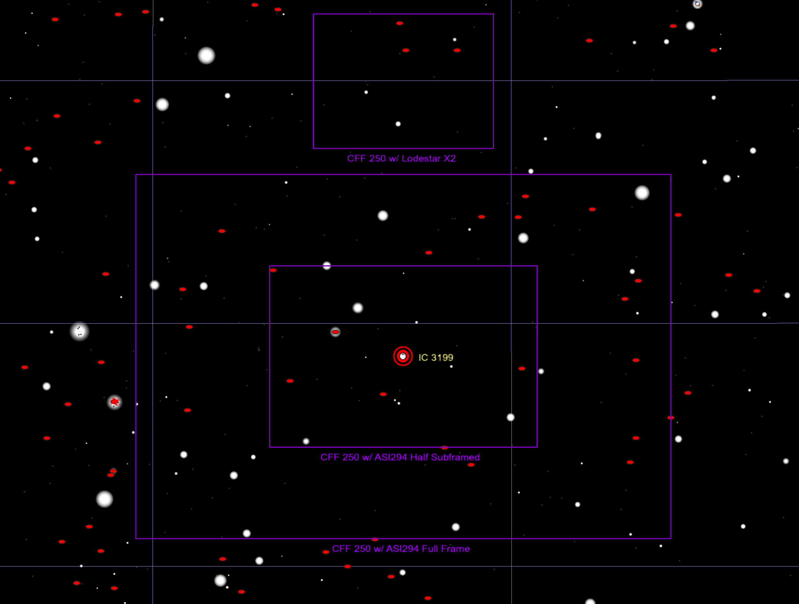
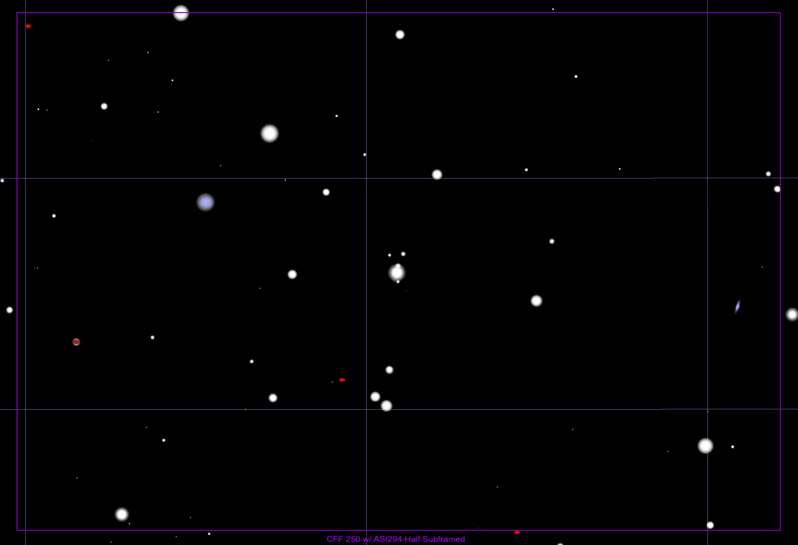

## ZTF23aafgazi Target Information

Back to [Index](../index.html)

### Interesting Features

* Rose from mag 18.5 to 18 in two days
* Separated from faint host
* SN Ia-91gb-like

### Discovery and Finder Charts

* [TNS Page](https://www.wis-tns.org/object/2023fot)
* [ALeRCE ZTF Explorer](https://alerce.online/object/ZTF23aafgazi)
* Discovery Date: 2023-04-17
* Host Name (and Aliases): Anonymous galaxy with redshift 0.044537 [2MASX J18260960+6025347(http://ned.ipac.caltech.edu/cgi-bin/nph-objsearch?objname=2MASX+J18260960%2B6025347&img_stamp=YES&list_limit=9&extend=no])
* Target Coordinates (J2000): RA 12h 21m 47.574s, DEC +10&deg; 35' 29.21"

