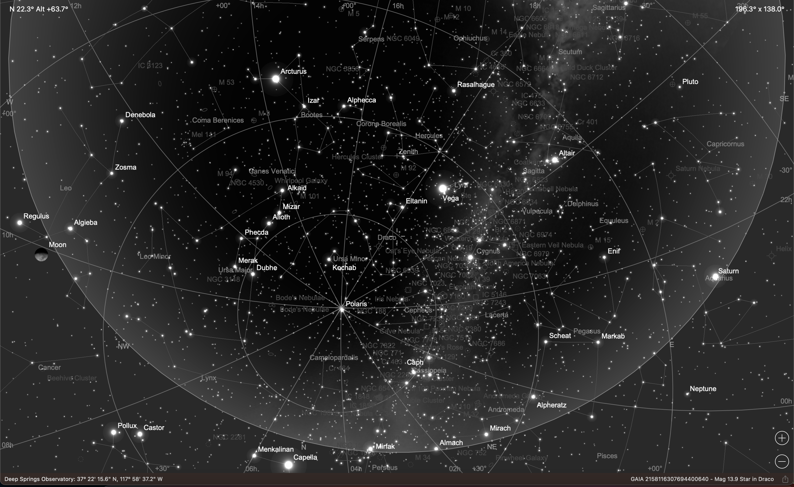
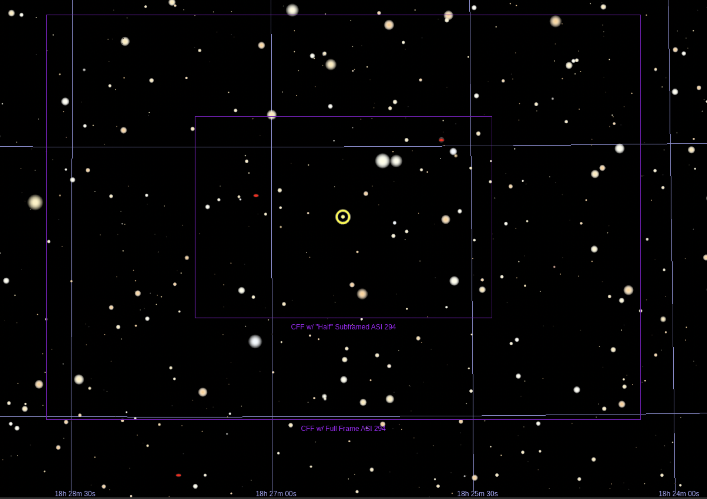
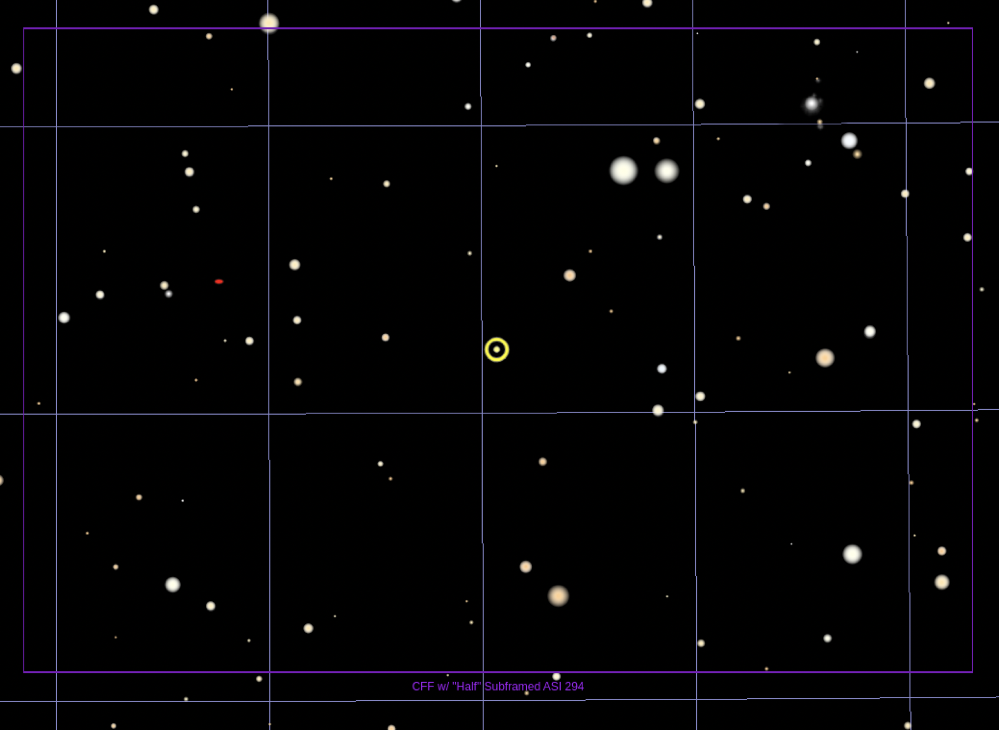
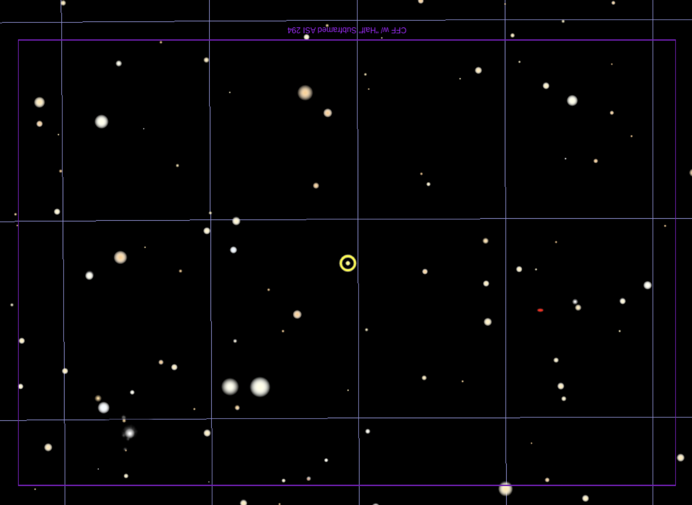

## ZTF23aagdamr Target Information

Back to [Index](../index.html)

### Interesting Features 

* Somewhat separated from center of elliptical galaxy
* Rose from magnitude 19 to 18 in 2 days

### Discovery and Finder Charts

* [ALeRCE ZTF Explorer](https://alerce.online/object/ZTF23aagdamr)
* [TNS Page](https://www.wis-tns.org/object/2023fyz)
* Host Name (and Aliases): Anonymous galaxy
* Nearby star in SkySafari: GAIA 2158116307694400640
* Nearby star in TheSkyX: UCAC4 504:54241
* Target Coordinates (J2000): RA 18h 26m 9.509s, DEC +60&deg; 25' 37.69"

*SkySafari Finder Chart at moonset, 10:18am UTC, 3:18am local time, Saturday, 4/29, just over an hour before the 11:24am astronomical dawn*

*TheSkyX Finder Chart*

*TheSkyX Finder Chart Zoomed*

*TheSkyX Finder Chart Zoomed with North Down*

