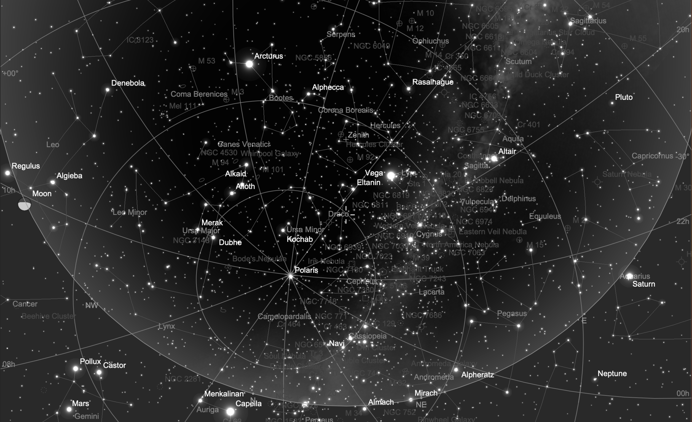

## ZTF23aagdamr Target Information

Back to [Index](../index.html)

### Interesting Features 

* Somewhat separated from center of elliptical galaxy
* Rose from magnitude 19 to 18 in 2 days

### Discovery and Finder Charts

* [TNS Page](https://www.wis-tns.org/object/2023fyz)
* [ALeRCE ZTF Explorer](https://alerce.online/object/ZTF23aagdamr)
* Discovery Date: 2023-04-17
* Host Name (and Aliases): Anonymous galaxy
* Target Coordinates (J2000): RA 18h 26m 9.509s, DEC +60&deg; 25' 37.69"

